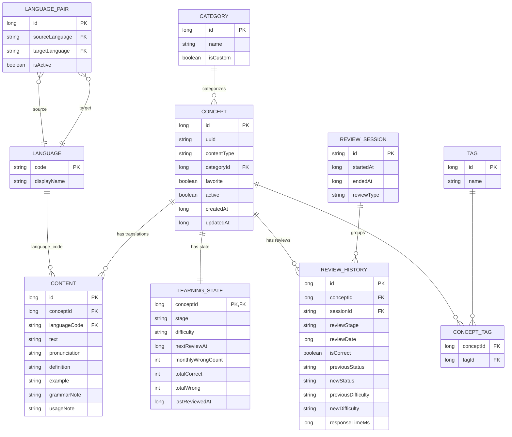

# طراحی اولیه اپلیکیشن فلش‌کارت (فاز صفر)

این سند فقط شامل معماری، ER Diagram، Schema دیتابیس، User Flow، Navigation Map، Design System و ساختار پروژه است. کدنویسی از سند بعدی شروع می‌شود.

---

## 1. معماری کلی (Clean Architecture)

```
com.app.flashlearn
│
├── core/              # ابزارهای مشترک (Result wrapper, DateTime utils, Constants)
├── database/           # لایه Room: Entities, DAO, Database, Migrations
├── data/                # پیاده‌سازی Repository ها + Data Sources (local/AI)
├── domain/              # Business Logic خالص: Models, UseCase, Repository Interface
├── presentation/        # ViewModel + UI State
├── ui/                  # Jetpack Compose Screens + Components + Theme
├── navigation/           # NavGraph و Route ها
└── di/                   # Dependency Injection (Hilt)
```

جریان داده:

```
UI (Compose) → ViewModel → UseCase (Domain) → Repository Interface (Domain)
                                                        ↑ پیاده‌سازی در Data
Repository Impl (Data) → DAO (Database) → Room → SQLite
```

نکات کلیدی:
- ماژول `domain` هیچ وابستگی‌ای به Android SDK یا Room ندارد؛ کاملاً قابل Unit Test.
- `data` مسئول تبدیل Entity ↔ Domain Model است (Mapper جداگانه).
- تصمیم الگوریتم مرور (Daily/Weekly/Monthly) در یک `UseCase` مستقل قرار می‌گیرد، نه در ViewModel.

تکنولوژی نهایی: Kotlin، Jetpack Compose، Material 3، Room، Coroutines + Flow، Hilt برای DI، minSdk پیشنهادی 26 (پوشش بیش از 90 درصد دستگاه‌های فعال).

---

## 2. ER Diagram



---

## 3. Database Schema (جدول‌ها)

### Language
| فیلد | نوع | توضیح |
|---|---|---|
| code (PK) | TEXT | مثل `fa`, `es`, `en` |
| displayName | TEXT | نام نمایشی |

### Concept
| فیلد | نوع | توضیح |
|---|---|---|
| id (PK) | INTEGER autoincrement | شناسه داخلی |
| uuid | TEXT UNIQUE INDEX | برای Import/Export بدون Collision |
| contentType | TEXT | WORD / PHRASE / SENTENCE / IDIOM / VERB / EXPRESSION / DIALOGUE |
| categoryId (FK) | INTEGER | ارجاع به Category |
| favorite | INTEGER(bool) | |
| active | INTEGER(bool) | Soft delete/Archive |
| createdAt / updatedAt | LONG | Epoch millis |

Index: `uuid`, `categoryId`, `active`

### Content (ترجمه/متن هر Concept در یک زبان)
| فیلد | نوع | توضیح |
|---|---|---|
| id (PK) | INTEGER | |
| conceptId (FK) | INTEGER | |
| languageCode (FK) | TEXT | |
| text | TEXT | متن اصلی در آن زبان |
| pronunciation | TEXT nullable | |
| definition | TEXT nullable | |
| example | TEXT nullable | |
| grammarNote | TEXT nullable | |
| usageNote | TEXT nullable | |

Index ترکیبی: `(conceptId, languageCode)` یکتا — هر Concept فقط یک رکورد Content به‌ازای هر زبان دارد.
Index جداگانه روی `languageCode` و `text` برای جستجو.

این جدول همان چیزی است که در بند 9 و 72 خواسته شده: هیچ ستون ثابتی مثل `spanish_text` وجود ندارد.

### LearningState (وضعیت مرور هر Concept)
| فیلد | نوع | توضیح |
|---|---|---|
| conceptId (PK, FK) | INTEGER | یک‌به‌یک با Concept |
| stage | TEXT | DAILY / WEEKLY / MONTHLY / LEARNED |
| difficulty | TEXT | EASY / MEDIUM / HARD / VERY_HARD |
| nextReviewAt | LONG nullable | Epoch millis؛ برای DAILY معمولاً null یا فوری |
| monthlyWrongCount | INTEGER | برای محاسبه VERY_HARD |
| totalCorrect / totalWrong | INTEGER | شمارنده کلی |
| lastReviewedAt | LONG nullable | |

Index: `stage`, `nextReviewAt`, `difficulty` — این‌ها مستقیماً در Query های بند 20 و 22 استفاده می‌شوند.

### ReviewHistory
شامل تمام فیلدهای بند 27 (هرگز حذف نمی‌شود). FK به `conceptId` و `sessionId`.
Index: `conceptId`, `sessionId`, `reviewDate`.

### ReviewSession
`id` (TEXT، مثل `2026-08-16-001`)، `startedAt`, `endedAt`, `reviewType`.

### Category / Tag / ConceptTag
Category: `id`, `name`, `isCustom`.
Tag: `id`, `name` (Unique).
ConceptTag: جدول Many-to-Many با `conceptId` و `tagId` به‌عنوان Composite PK.

### LanguagePair
`id`, `sourceLanguage (FK)`, `targetLanguage (FK)`, `isActive` — تعیین می‌کند کاربر الان کدام جهت را انتخاب کرده؛ تغییر جهت فقط رکورد فعال را عوض می‌کند، دیتای Concept دست‌نخورده می‌ماند (بند 71).

### AppSettings
Key-Value ساده: تم، جهت زبان فعال، تنظیمات AI (بدون API Key)، تنظیمات Review.

---

## 4. Review Algorithm (خلاصه منطق دامنه)

```
onAnswer(concept, isCorrect):
  switch(currentStage):
    DAILY:
        if correct: stage = WEEKLY, nextReviewAt = now + 7d
        else: stage = DAILY (بدون تغییر)

    WEEKLY:
        if correct: stage = MONTHLY, nextReviewAt = now + 30d
        else: stage = DAILY, difficulty = max(difficulty, MEDIUM)

    MONTHLY:
        if correct:
            if firstTimeSuccessAllStages: difficulty = EASY
            stage = LEARNED
        else:
            monthlyWrongCount++
            stage = DAILY
            difficulty = monthlyWrongCount > 1 ? VERY_HARD : HARD

    LEARNED (مرور اختیاری):
        history ثبت می‌شود ولی stage تغییر نمی‌کند مگر Setting دیگری فعال باشد
```

Query انتخاب کارت‌های آماده:
```sql
-- Weekly/Monthly
SELECT * FROM concept c
JOIN learning_state ls ON ls.conceptId = c.id
WHERE ls.stage = :stage AND ls.nextReviewAt <= :now
```
این دقیقاً معادل بند 20، 22 و 31 است.

---

## 5. User Flow (سطح بالا)

```
[اولین اجرا]
Splash → Onboarding(انتخاب زبان مبدا/مقصد) → Home Dashboard

[روزمره]
Home Dashboard
   → کارت Daily/Weekly/Monthly → Review Session → نتیجه → بازگشت به Dashboard
   → Vocabulary List → جستجو/فیلتر → ویرایش/حذف/Favorite
   → Add → (Manual | AI | Paste | Import File) → Preview → Save
   → Statistics
   → Settings → (Theme | Language Pair | Backup/Restore | AI Settings)
```

---

## 6. Navigation Map (Compose Navigation)

Bottom Navigation با 5 مقصد اصلی:

```
NavGraph
├── home            (Dashboard)
├── review
│   ├── reviewTypeSelect
│   └── reviewSession/{type}
├── vocabulary
│   ├── vocabularyList
│   └── conceptDetail/{id}
├── add
│   ├── addManual
│   ├── addAI
│   ├── addPasteText
│   └── addImportFile
└── settings
    ├── settingsHome
    ├── backupRestore
    └── aiSettings

+ statistics (از Home قابل دسترسی، خارج از Bottom Nav)
+ onboarding (فقط اولین اجرا، جدا از Graph اصلی)
```

---

## 7. Design System (خلاصه توکن‌ها)

| Token | مقدار پیشنهادی (Light) | مقدار پیشنهادی (Dark) |
|---|---|---|
| Primary | Indigo تیره (#4F46E5) | Indigo روشن‌تر (#818CF8) |
| Secondary | Teal (#14B8A6) | Teal روشن (#2DD4BF) |
| Background | #FAFAFA | #121212 |
| Surface | #FFFFFF | #1E1E1E |
| Success | #22C55E | #4ADE80 |
| Error | #EF4444 | #F87171 |
| Warning | #F59E0B | #FBBF24 |
| Due (آماده مرور) | #3B82F6 | #60A5FA |
| Completed/Learned | #8B5CF6 | #A78BFA |

Typography: یک فونت خوانا با پشتیبانی کامل از حروف فارسی و لاتین (مثلاً Vazirmatn برای فارسی در کنار فونت پیش‌فرض Material برای زبان‌های لاتین).

Spacing: مقیاس 4dp (4, 8, 12, 16, 24, 32).
Corner Radius: کارت‌ها 16dp، دکمه‌ها 12dp، Chip ها Full-rounded.
Elevation: سطح کم (1-3dp) برای حس مینیمال، با سایه نرم.
Icon Style: Outline برای حالت غیرفعال، Filled برای حالت فعال/انتخاب‌شده.

---

## 8. ساختار پروژه (Module/Package نهایی)

```
app/
 └── src/main/java/com/app/flashlearn/
      ├── core/
      │    ├── util/ (DateTimeUtils, Result, Constants)
      │    └── di/
      ├── database/
      │    ├── entity/
      │    ├── dao/
      │    ├── FlashLearnDatabase.kt
      │    └── migration/
      ├── data/
      │    ├── repository/
      │    ├── mapper/
      │    ├── ai/ (AIService + Providers)
      │    └── importexport/
      ├── domain/
      │    ├── model/
      │    ├── repository/ (interfaces)
      │    └── usecase/
      ├── presentation/
      │    ├── home/
      │    ├── review/
      │    ├── vocabulary/
      │    ├── add/
      │    ├── settings/
      │    └── statistics/
      ├── ui/
      │    ├── theme/
      │    └── components/
      └── navigation/
```

---

## نکته مهم برای تأیید قبل از شروع کدنویسی

قبل از رفتن به مرحله پیاده‌سازی، دو نکته معماری نیاز به تصمیم صریح شما دارد:

1. **Content vs Concept برای زبان مبدا**: چون هر Concept می‌تواند چند Content (ترجمه) داشته باشد، «متن اصلی» که کاربر وارد کرده (مثلاً هنگام Manual Entry) هم به‌صورت یک رکورد Content با `languageCode = sourceLanguage` ذخیره می‌شود؛ یعنی زبان مبدا و مقصد از نظر ساختار داده تفاوتی ندارند، فقط در UI بر اساس LanguagePair فعال تعیین می‌شود کدام Content به‌عنوان روی کارت و کدام پشت کارت نمایش داده شود. تأیید می‌کنید؟

2. **Dependency Injection**: پیشنهاد Hilt است (استاندارد رسمی Android برای Clean Architecture). اگر ترجیح دیگری دارید (Koin یا بدون DI Framework) اطلاع دهید.

اگر این طراحی را تأیید کنید، مرحله بعدی: راه‌اندازی پروژه (Gradle، Entities، DAO، Database، Migration پایه) به همراه تست‌های مربوطه است.
